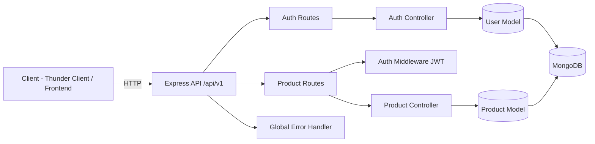
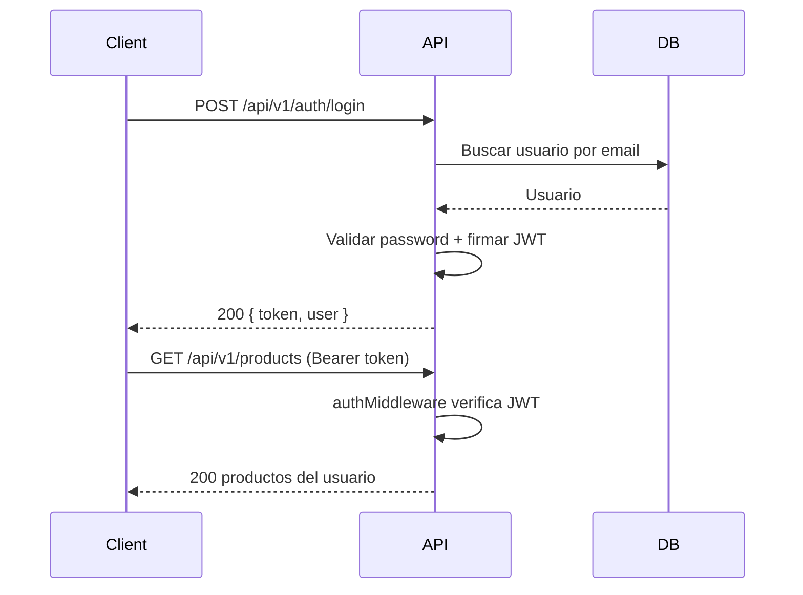
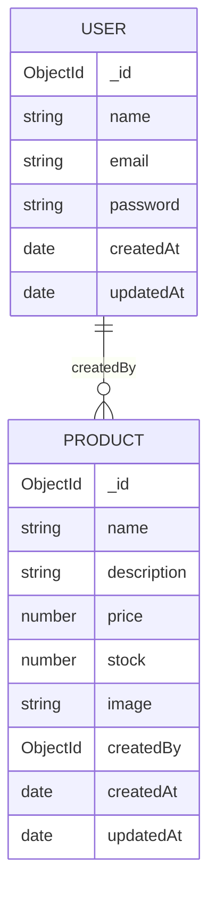

# Step 1 - Backend API REST (MERN)

Este paso implementa el backend base con Node.js, Express, MongoDB, JWT y CRUD de productos protegido.

## Arquitectura general



## Flujo de autenticacion



## ERD de modelos



## Instalacion

1. Ir a la carpeta backend.
2. Instalar dependencias.
3. Crear .env desde .env.example.
4. Ejecutar en modo desarrollo.

```bash
cd step_1/backend
npm install
npm run dev
```

## Dependencias instaladas en este paso

Dependencias de aplicacion (`dependencies`):

- `bcryptjs`
- `cors`
- `dotenv`
- `express`
- `express-validator`
- `helmet`
- `jsonwebtoken`
- `mongoose`
- `morgan`
- `multer`

Dependencias de desarrollo (`devDependencies`):

- `nodemon`

Comando completo de instalacion (referencia):

```bash
npm install bcryptjs cors dotenv express express-validator helmet jsonwebtoken mongoose morgan multer
npm install -D nodemon
```

## Orden logico recomendado para escribir el codigo (desde cero)

1. `server.js` y `src/app.js`.
2. `src/database/connection.js`.
3. Modelos: `src/models/User.js` y `src/models/Product.js`.
4. Utilidades: `src/utils/httpCodes.js`, `src/utils/appError.js`, `src/utils/asyncHandler.js`.
5. Validadores: `src/validators/authValidators.js` y `src/validators/productValidators.js`.
6. Middlewares base: `src/middlewares/validate.js`, `src/middlewares/authMiddleware.js`, `src/middlewares/uploadMiddleware.js`.
7. Controllers: `src/controllers/authController.js` y `src/controllers/productController.js`.
8. Routes: `src/routes/authRoutes.js` y `src/routes/productRoutes.js`.
9. Middlewares finales: `src/middlewares/notFound.js` y `src/middlewares/errorHandler.js`.
10. Integrar todo en `src/app.js` y validar con Thunder Client.

## Variables de entorno

Archivo: step_1/backend/.env

```env
NODE_ENV=development
PORT=5000
MONGODB_URI=mongodb://127.0.0.1:27017/mern_step_1
JWT_SECRET=change_me_super_secret
JWT_EXPIRES_IN=1d
CORS_ORIGIN=http://localhost:5173
```

## Endpoints principales

- POST /api/v1/auth/register
- POST /api/v1/auth/login
- GET /api/v1/products
- GET /api/v1/products/:id
- POST /api/v1/products
- PUT /api/v1/products/:id
- DELETE /api/v1/products/:id

## Pruebas con Thunder Client

Esta seccion esta pensada como tutorial guiado para validar toda la API.

### 1. Preparacion en Thunder Client

1. Abre VS Code y entra a Thunder Client.
2. Crea una request nueva por cada endpoint del tutorial (manual).
3. Nota importante para version Free:
  - En esta guia no se usan variables de entorno de Thunder Client.
  - El token y el productId se copian y pegan manualmente en cada request.

### Opcional: datos semilla para MongoDB

Si quieres arrancar con datos iniciales en tu base, puedes usar:

- step_1/backend/.thunder-collection.json

Ese archivo ahora contiene datos semilla en formato JSON/EJSON para importar en:

1. MongoDB Compass (Import Data en cada coleccion).
2. mongosh (insertMany desde script).
3. MongoDB for VS Code con Playground.

Nota:

- El usuario semilla es jane@example.com y su password de prueba es Password1.
- Para el flujo pedagogico de API, aun se recomienda ejecutar register/login manualmente.

Base URL usada en los ejemplos:

- http://localhost:5000/api/v1

### 2. Health check (sin token)

Objetivo: confirmar que el servidor esta corriendo.

1. Verbo: GET
2. Endpoint: /health
3. Headers: ninguno
4. Body: vacio

Respuesta esperada (200):

```json
{
  "success": true,
  "message": "API is healthy",
  "timestamp": "2026-03-25T15:00:00.000Z"
}
```

### 3. Registro de usuario

Objetivo: crear un usuario para autenticacion.

1. Verbo: POST
2. Endpoint: /auth/register
3. Header obligatorio:
   - Content-Type: application/json
4. Body JSON:

```json
{
  "name": "Jane Dev",
  "email": "jane@example.com",
  "password": "Password1"
}
```

Respuesta esperada (201):

```json
{
  "success": true,
  "message": "User registered successfully",
  "data": {
    "user": {
      "_id": "65f7e8d6b7f6d93f5a2f1111",
      "name": "Jane Dev",
      "email": "jane@example.com",
      "createdAt": "2026-03-25T15:00:00.000Z",
      "updatedAt": "2026-03-25T15:00:00.000Z"
    },
    "token": "eyJhbGciOiJIUzI1NiIsInR5cCI6IkpXVCJ9..."
  }
}
```

Nota educativa:

- Si repites el mismo email, debe devolver 400.

### 4. Login

Objetivo: obtener token JWT para rutas protegidas.

1. Verbo: POST
2. Endpoint: /auth/login
3. Header obligatorio:
   - Content-Type: application/json
4. Body JSON:

```json
{
  "email": "jane@example.com",
  "password": "Password1"
}
```

Respuesta esperada (200):

```json
{
  "success": true,
  "message": "Login successful",
  "data": {
    "user": {
      "_id": "65f7e8d6b7f6d93f5a2f1111",
      "name": "Jane Dev",
      "email": "jane@example.com",
      "createdAt": "2026-03-25T15:00:00.000Z",
      "updatedAt": "2026-03-25T15:00:00.000Z"
    },
    "token": "eyJhbGciOiJIUzI1NiIsInR5cCI6IkpXVCJ9..."
  }
}
```

Accion obligatoria:

1. Copia el token del response.
2. Guardalo temporalmente para pegarlo manualmente en el header Authorization de las rutas protegidas.

### 5. Crear producto (ruta protegida)

Objetivo: crear un producto asociado al usuario autenticado.

1. Verbo: POST
2. Endpoint: /products
3. Headers obligatorios:
   - Content-Type: application/json
  - Authorization: Bearer TU_TOKEN_JWT_AQUI
4. Body JSON:

```json
{
  "name": "Mechanical Keyboard",
  "description": "Hot-swappable keyboard with RGB",
  "price": 99.99,
  "stock": 12
}
```

Respuesta esperada (201):

```json
{
  "success": true,
  "message": "Product created successfully",
  "data": {
    "_id": "65f7e9cbb7f6d93f5a2f2222",
    "name": "Mechanical Keyboard",
    "description": "Hot-swappable keyboard with RGB",
    "price": 99.99,
    "stock": 12,
    "image": "",
    "createdBy": "65f7e8d6b7f6d93f5a2f1111",
    "createdAt": "2026-03-25T15:05:00.000Z",
    "updatedAt": "2026-03-25T15:05:00.000Z"
  }
}
```

Accion obligatoria:

1. Copia data._id.
2. Guardalo temporalmente para pegarlo manualmente en las rutas que requieren id.

### 6. Listar productos (ruta protegida)

Objetivo: validar lectura con paginacion.

1. Verbo: GET
2. Endpoint: /products?page=1&limit=10
3. Header obligatorio:
  - Authorization: Bearer TU_TOKEN_JWT_AQUI
4. Body: vacio

Respuesta esperada (200):

```json
{
  "success": true,
  "message": "Products fetched successfully",
  "data": [
    {
      "_id": "65f7e9cbb7f6d93f5a2f2222",
      "name": "Mechanical Keyboard",
      "description": "Hot-swappable keyboard with RGB",
      "price": 99.99,
      "stock": 12,
      "image": "",
      "createdBy": "65f7e8d6b7f6d93f5a2f1111",
      "createdAt": "2026-03-25T15:05:00.000Z",
      "updatedAt": "2026-03-25T15:05:00.000Z"
    }
  ],
  "meta": {
    "total": 1,
    "page": 1,
    "limit": 10,
    "totalPages": 1
  }
}
```

### 7. Obtener producto por ID (ruta protegida)

Objetivo: validar lectura individual.

1. Verbo: GET
2. Endpoint: /products/PRODUCT_ID_AQUI
3. Header obligatorio:
  - Authorization: Bearer TU_TOKEN_JWT_AQUI
4. Body: vacio

Respuesta esperada (200):

```json
{
  "success": true,
  "message": "Product fetched successfully",
  "data": {
    "_id": "65f7e9cbb7f6d93f5a2f2222",
    "name": "Mechanical Keyboard",
    "description": "Hot-swappable keyboard with RGB",
    "price": 99.99,
    "stock": 12,
    "image": "",
    "createdBy": "65f7e8d6b7f6d93f5a2f1111",
    "createdAt": "2026-03-25T15:05:00.000Z",
    "updatedAt": "2026-03-25T15:05:00.000Z"
  }
}
```

### 8. Actualizar producto (ruta protegida)

Objetivo: validar update de un recurso propio.

1. Verbo: PUT
2. Endpoint: /products/PRODUCT_ID_AQUI
3. Headers obligatorios:
   - Content-Type: application/json
  - Authorization: Bearer TU_TOKEN_JWT_AQUI
4. Body JSON:

```json
{
  "price": 89.99,
  "stock": 20
}
```

Respuesta esperada (200):

```json
{
  "success": true,
  "message": "Product updated successfully",
  "data": {
    "_id": "65f7e9cbb7f6d93f5a2f2222",
    "name": "Mechanical Keyboard",
    "description": "Hot-swappable keyboard with RGB",
    "price": 89.99,
    "stock": 20,
    "image": "",
    "createdBy": "65f7e8d6b7f6d93f5a2f1111",
    "createdAt": "2026-03-25T15:05:00.000Z",
    "updatedAt": "2026-03-25T15:10:00.000Z"
  }
}
```

### 9. Eliminar producto (ruta protegida)

Objetivo: validar borrado de recurso propio.

1. Verbo: DELETE
2. Endpoint: /products/PRODUCT_ID_AQUI
3. Header obligatorio:
  - Authorization: Bearer TU_TOKEN_JWT_AQUI
4. Body: vacio

Respuesta esperada (204):

- No Content (sin body).

### 10. Validaciones de seguridad recomendadas

Prueba estas situaciones para comprobar errores esperados:

1. GET /products sin Authorization -> debe responder 401.
2. POST /auth/register con email repetido -> debe responder 400.
3. POST /auth/login con password incorrecta -> debe responder 401.
4. POST /products con campos faltantes -> debe responder 422.

Ejemplo de error estandar:

```json
{
  "success": false,
  "message": "Validation error - name: name is required"
}
```

## Buenas practicas implementadas

- API versionada desde inicio con /api/v1.
- Manejo global de errores con formato consistente.
- Validacion de body/query/params con express-validator.
- Auth JWT para proteger CRUD de productos.
- Separacion por capas: models, controllers, routes, middlewares, utils.
