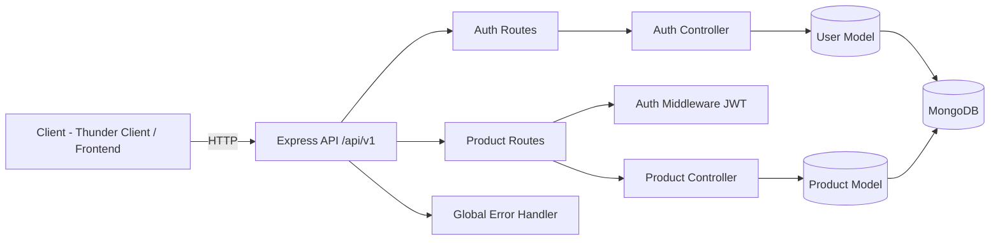
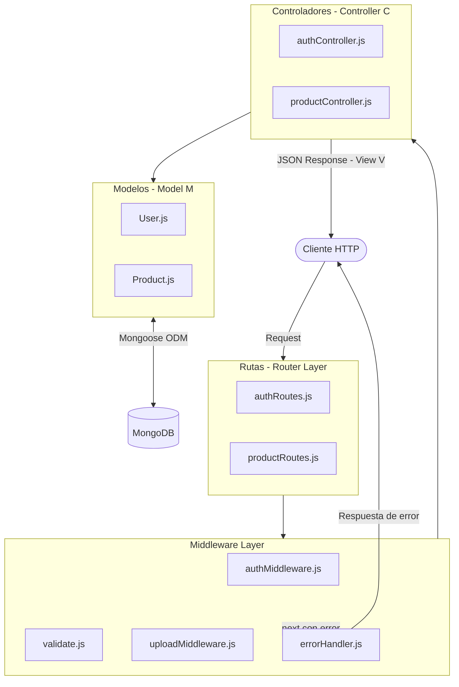
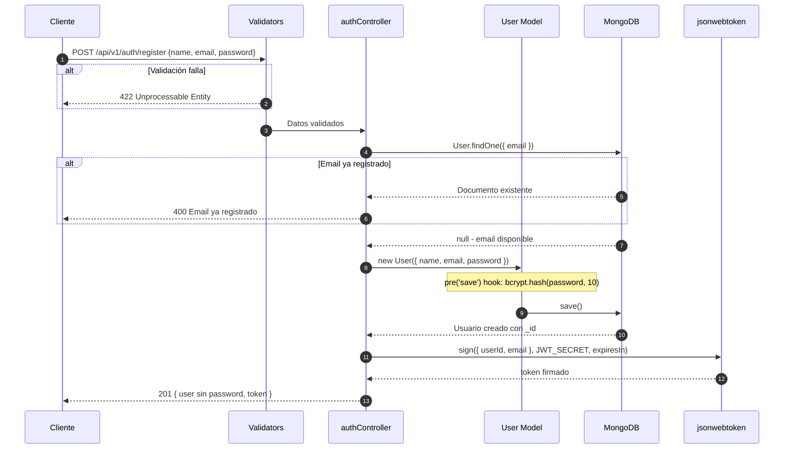
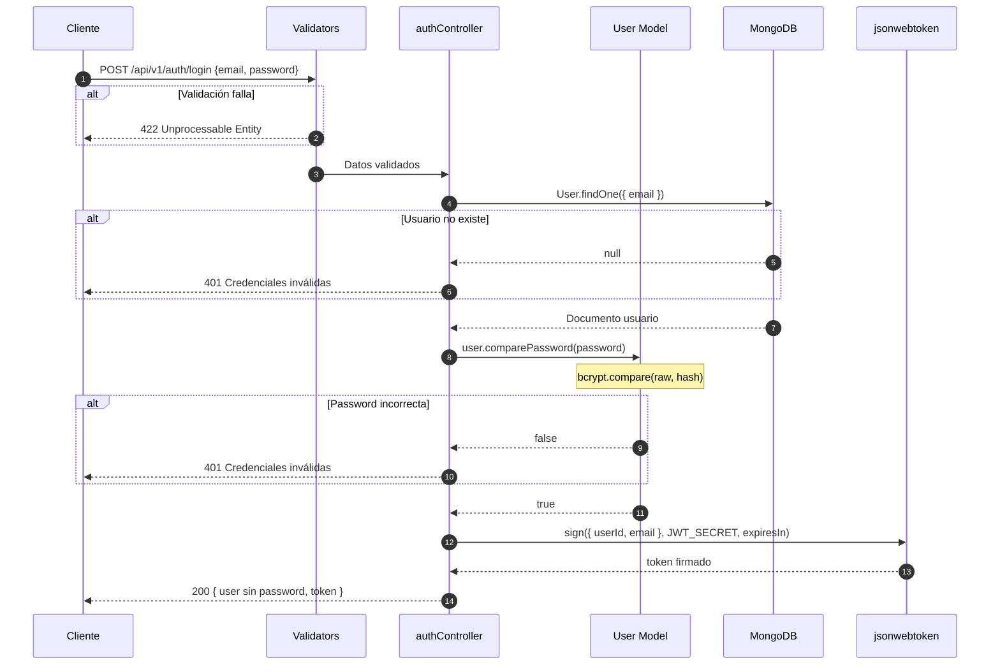
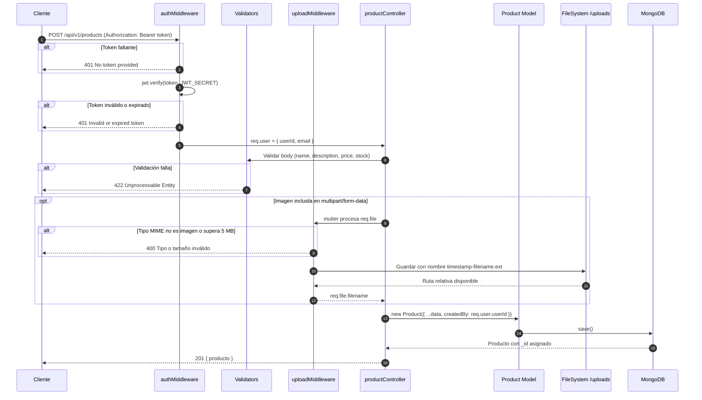
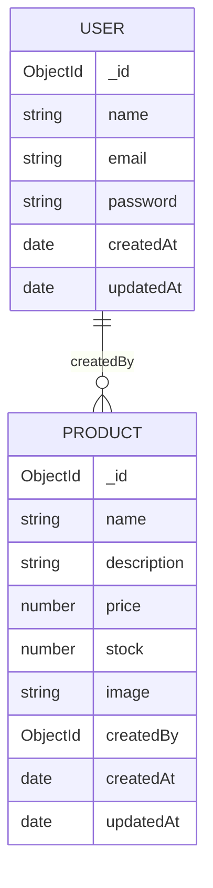
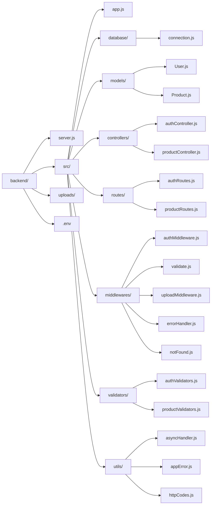

# Step 1 - Backend API REST (MERN)

Este paso implementa el backend base con Node.js, Express, MongoDB, JWT y CRUD de productos protegido.

## Stack tecnológico

| Dependencia | Versión | Propósito |
|---|---|---|
| `express` | 5.2.1 | Framework HTTP y sistema de rutas |
| `mongoose` | 9.3.2 | ODM para MongoDB: esquemas, consultas y hooks |
| `jsonwebtoken` | 9.0.3 | Generación y verificación de tokens JWT |
| `bcryptjs` | 3.0.3 | Hash seguro de contraseñas con salt |
| `express-validator` | 7.3.1 | Validación y sanitización de inputs por campo |
| `multer` | 2.1.1 | Manejo de subida de archivos multipart/form-data |
| `cors` | 2.8.6 | Configuración de política de mismo origen (CORS) |
| `helmet` | 8.1.0 | Cabeceras HTTP de seguridad automáticas |
| `morgan` | 1.10.1 | Logger de peticiones HTTP en consola |
| `dotenv` | 17.3.1 | Carga de variables de entorno desde `.env` |
| `nodemon` | 3.1.14 | Recarga automática del servidor en desarrollo |

## Arquitectura general


```mermaid
flowchart LR
  C[Client - Thunder Client / Frontend] -->|HTTP| A[Express API /api/v1]
  A --> R1[Auth Routes]
  A --> R2[Product Routes]
  R2 --> M[Auth Middleware JWT]
  R1 --> CT1[Auth Controller]
  R2 --> CT2[Product Controller]
  CT1 --> U[(User Model)]
  CT2 --> P[(Product Model)]
  U --> DB[(MongoDB)]
  P --> DB
  A --> EH[Global Error Handler]
```

## Arquitectura MVC del Backend

El backend aplica el patrón MVC adaptado a una API REST, donde la "Vista" es sustituida por respuestas JSON serializadas.


```mermaid
flowchart TD
    CLIENT([Cliente HTTP])

    subgraph ROUTES["Rutas - Router Layer"]
        AR[authRoutes.js]
        PR[productRoutes.js]
    end

    subgraph MW["Middleware Layer"]
        AM[authMiddleware.js]
        VM[validate.js]
        UP[uploadMiddleware.js]
        EH[errorHandler.js]
    end

    subgraph CTRL["Controladores - Controller C"]
        AC[authController.js]
        PC[productController.js]
    end

    subgraph MOD["Modelos - Model M"]
        UM[User.js]
        PM[Product.js]
    end

    CLIENT -->|Request| ROUTES
    ROUTES --> MW
    MW --> CTRL
    CTRL --> MOD
    MOD <-->|Mongoose ODM| DB[(MongoDB)]
    CTRL -->|JSON Response - View V| CLIENT
    MW -->|next con error| EH
    EH -->|Respuesta de error| CLIENT
```

### Responsabilidades por capa

| Capa | Archivos | Responsabilidad |
|---|---|---|
| **Router** | `authRoutes.js`, `productRoutes.js` | Mapear endpoints HTTP a middlewares y controladores |
| **Controller (C)** | `authController.js`, `productController.js` | Orquestar la lógica de negocio: recibe la request, consulta el modelo y devuelve la respuesta |
| **Model (M)** | `User.js`, `Product.js` | Definir el esquema de datos, validaciones de Mongoose, métodos de instancia y hooks del ciclo de vida |
| **Middleware** | `authMiddleware.js`, `validate.js`, `uploadMiddleware.js`, `errorHandler.js`, `notFound.js` | Funciones interceptoras reutilizables para autenticación JWT, validación de inputs, subida de archivos y manejo centralizado de errores |
| **Validators** | `authValidators.js`, `productValidators.js` | Arreglos de reglas express-validator por recurso y operación |
| **Utils** | `asyncHandler.js`, `appError.js`, `httpCodes.js` | Herramientas reutilizables: wrapper de async/await, clase de error personalizada y constantes de códigos HTTP |
| **Database** | `database/connection.js` | Inicializar y exportar la conexión Mongoose a MongoDB |

## Flujo de autenticación

### Registro de usuario


```mermaid
sequenceDiagram
    autonumber
    participant C as Cliente
    participant V as Validators
    participant AC as authController
    participant U as User Model
    participant DB as MongoDB
    participant JWT as jsonwebtoken

    C->>V: POST /api/v1/auth/register {name, email, password}
    alt Validación falla
        V-->>C: 422 Unprocessable Entity
    end
    V->>AC: Datos validados
    AC->>DB: User.findOne({ email })
    alt Email ya registrado
        DB-->>AC: Documento existente
        AC-->>C: 400 Email ya registrado
    end
    DB-->>AC: null - email disponible
    AC->>U: new User({ name, email, password })
    Note over U: pre('save') hook: bcrypt.hash(password, 10)
    U->>DB: save()
    DB-->>AC: Usuario creado con _id
    AC->>JWT: sign({ userId, email }, JWT_SECRET, expiresIn)
    JWT-->>AC: token firmado
    AC-->>C: 201 { user sin password, token }
```

**Paso a paso:**

1. El cliente envía `POST /api/v1/auth/register` con `name`, `email` y `password`.
2. El arreglo de validadores de express-validator verifica las reglas: nombre mínimo 2 caracteres, email con formato válido, password con al menos una mayúscula y un dígito.
3. El middleware `validate.js` detecta errores de validación y responde `422` con el detalle si los hay.
4. `authController.register` consulta MongoDB para verificar que el email no esté registrado.
5. Si el email ya existe, responde `400` sin revelar información adicional.
6. Se instancia un nuevo documento `User`. El hook `pre('save')` de Mongoose ejecuta `bcrypt.hash(password, 10)` automáticamente antes de persistir.
7. El documento se guarda en MongoDB y se obtiene el `_id` generado.
8. Se firma un JWT con el payload `{ userId, email }` usando `JWT_SECRET` y la duración de `JWT_EXPIRES_IN`.
9. Se responde `201` con el objeto usuario (el método `toJSON()` del modelo excluye el campo `password`) y el token.

### Login


```mermaid
sequenceDiagram
    autonumber
    participant C as Cliente
    participant V as Validators
    participant AC as authController
    participant U as User Model
    participant DB as MongoDB
    participant JWT as jsonwebtoken

    C->>V: POST /api/v1/auth/login {email, password}
    alt Validación falla
        V-->>C: 422 Unprocessable Entity
    end
    V->>AC: Datos validados
    AC->>DB: User.findOne({ email })
    alt Usuario no existe
        DB-->>AC: null
        AC-->>C: 401 Credenciales inválidas
    end
    DB-->>AC: Documento usuario
    AC->>U: user.comparePassword(password)
    Note over U: bcrypt.compare(raw, hash)
    alt Password incorrecta
        U-->>AC: false
        AC-->>C: 401 Credenciales inválidas
    end
    U-->>AC: true
    AC->>JWT: sign({ userId, email }, JWT_SECRET, expiresIn)
    JWT-->>AC: token firmado
    AC-->>C: 200 { user sin password, token }
```

**Paso a paso:**

1. El cliente envía `POST /api/v1/auth/login` con `email` y `password`.
2. Los validadores verifican que `email` tenga formato válido y que `password` no esté vacío.
3. `authController.login` busca el usuario en MongoDB por email.
4. Si el usuario no existe, responde `401` con un mensaje genérico que no revela si el email está registrado (seguridad por oscuridad).
5. Se llama al método de instancia `comparePassword()` del modelo, que internamente usa `bcrypt.compare` para comparar el texto plano con el hash almacenado.
6. Si la contraseña no coincide, responde `401` con el mismo mensaje genérico.
7. Se firma el JWT y se responde `200` con el usuario (sin password) y el token.

## Flujo CRUD protegido

### Ejemplo: Crear producto


```mermaid
sequenceDiagram
    autonumber
    participant C as Cliente
    participant AM as authMiddleware
    participant V as Validators
    participant UP as uploadMiddleware
    participant PC as productController
    participant PM as Product Model
    participant FS as FileSystem /uploads
    participant DB as MongoDB

    C->>AM: POST /api/v1/products (Authorization: Bearer token)
    alt Token faltante
        AM-->>C: 401 No token provided
    end
    AM->>AM: jwt.verify(token, JWT_SECRET)
    alt Token inválido o expirado
        AM-->>C: 401 Invalid or expired token
    end
    AM->>PC: req.user = { userId, email }
    PC->>V: Validar body (name, description, price, stock)
    alt Validación falla
        V-->>C: 422 Unprocessable Entity
    end
    opt Imagen incluida en multipart/form-data
        PC->>UP: multer procesa req.file
        alt Tipo MIME no es imagen o supera 5 MB
            UP-->>C: 400 Tipo o tamaño inválido
        end
        UP->>FS: Guardar con nombre timestamp-filename.ext
        FS-->>UP: Ruta relativa disponible
        UP-->>PC: req.file.filename
    end
    PC->>PM: new Product({ ...data, createdBy: req.user.userId })
    PM->>DB: save()
    DB-->>PC: Producto con _id asignado
    PC-->>C: 201 { producto }
```

**Paso a paso:**

1. El cliente envía `POST /api/v1/products` con el header `Authorization: Bearer <token>`.
2. `authMiddleware` extrae el token del header `Authorization` y verifica el esquema `Bearer`.
3. Si el token no existe, responde `401` con "No token provided".
4. Se llama a `jwt.verify(token, JWT_SECRET)`. Si el token expiró o la firma fue manipulada, responde `401`.
5. Con token válido, el payload decodificado `{ userId, email }` se adjunta a `req.user` para uso posterior.
6. Los validadores de producto comprueban `name` (2-100 chars), `description` (5-500 chars), `price` (número ≥ 0) y `stock` (entero ≥ 0).
7. Si el request es `multipart/form-data` con imagen, Multer filtra por MIME type (`image/*`) y tamaño (máx. 5 MB), genera un nombre único con timestamp y guarda en `/uploads`.
8. El controlador instancia un nuevo `Product` vinculando `createdBy: req.user.userId` para garantizar el ownership del recurso.
9. El documento se persiste en MongoDB y se retorna `201` con el producto creado.

> **Nota sobre autorización en otras operaciones:** En `GET`, `PUT` y `DELETE /products/:id` el controlador verifica que `product.createdBy.toString() === req.user.userId`. Si no coincide devuelve `403 Forbidden`; si no existe el producto devuelve `404`.

## ERD de modelos


```mermaid
erDiagram
  USER ||--o{ PRODUCT : "createdBy"
  USER {
    ObjectId _id
    string name
    string email
    string password
    date createdAt
    date updatedAt
  }
  PRODUCT {
    ObjectId _id
    string name
    string description
    number price
    number stock
    string image
    ObjectId createdBy
    date createdAt
    date updatedAt
  }
```

## Estructura de carpetas


```mermaid
graph LR
    ROOT[backend/] --> SRV[server.js]
    ROOT --> SRC[src/]
    ROOT --> UPL[uploads/]
    ROOT --> ENV[.env]
    SRC --> APP[app.js]
    SRC --> DB_DIR[database/]
    SRC --> MOD_DIR[models/]
    SRC --> CTRL_DIR[controllers/]
    SRC --> RT_DIR[routes/]
    SRC --> MW_DIR[middlewares/]
    SRC --> VAL_DIR[validators/]
    SRC --> UTL_DIR[utils/]
    DB_DIR --> CONN[connection.js]
    MOD_DIR --> UM[User.js]
    MOD_DIR --> PM[Product.js]
    CTRL_DIR --> AC[authController.js]
    CTRL_DIR --> PC[productController.js]
    RT_DIR --> AR[authRoutes.js]
    RT_DIR --> PR[productRoutes.js]
    MW_DIR --> AMW[authMiddleware.js]
    MW_DIR --> VMW[validate.js]
    MW_DIR --> UMW[uploadMiddleware.js]
    MW_DIR --> EH[errorHandler.js]
    MW_DIR --> NF[notFound.js]
    VAL_DIR --> AV[authValidators.js]
    VAL_DIR --> PV[productValidators.js]
    UTL_DIR --> ASH[asyncHandler.js]
    UTL_DIR --> AE[appError.js]
    UTL_DIR --> HC[httpCodes.js]
```

### Descripción de directorios

| Ruta | Descripción |
|---|---|
| `server.js` | Punto de entrada: conecta la base de datos e inicia el servidor Express en el puerto configurado |
| `src/app.js` | Instancia y configura Express: registra middlewares globales (CORS, Helmet, Morgan), monta rutas y registra los handlers de error |
| `src/database/connection.js` | Inicializa la conexión Mongoose a MongoDB y la exporta para ser usada en `server.js` |
| `src/models/` | Esquemas Mongoose con validaciones a nivel de modelo, métodos de instancia (`comparePassword`, `toJSON`) y hooks del ciclo de vida (`pre('save')`) |
| `src/controllers/` | Lógica de negocio de cada recurso. Coordina la llamada al modelo, aplica reglas de negocio y construye la respuesta JSON |
| `src/routes/` | Define los endpoints HTTP, aplica la cadena de middleware por ruta y delega al controlador correspondiente |
| `src/middlewares/` | Funciones interceptoras reutilizables: verificación JWT, procesamiento de errores de validación, subida de archivos y handler global de errores |
| `src/validators/` | Arreglos de reglas express-validator organizados por recurso y operación (register, login, create, update, etc.) |
| `src/utils/` | Utilidades de soporte: `asyncHandler` envuelve controllers async, `AppError` tipifica errores operacionales, `httpCodes` centraliza constantes de estado HTTP |
| `uploads/` | Directorio en disco donde Multer almacena las imágenes subidas. Las rutas relativas se guardan en el campo `image` de `Product` |

## Patrones de diseño aplicados

| Patrón | Archivos | Descripción |
|---|---|---|
| **MVC** (Model-View-Controller) | `models/`, `controllers/`, `routes/` | Separa datos (Model), lógica de negocio (Controller) y entrega de respuesta JSON (View). En APIs REST la View es la respuesta serializada |
| **Middleware Chain** (Chain of Responsibility) | `app.js`, `productRoutes.js` | Cada request pasa por una cadena ordenada de funciones independientes antes de llegar al controlador. Si una falla llama a `next(error)` |
| **Higher-Order Function / Wrapper** | `utils/asyncHandler.js` | Envuelve controladores async y captura errores del `await` pasándolos a `next()`, eliminando try/catch en cada controller |
| **Custom Error Class** | `utils/appError.js` | Extiende `Error` con `statusCode` para que el handler global distinga errores operacionales de errores de programación |
| **Factory Function** | `authController.js` → `signToken()` | Función que encapsula la creación consistente de JWTs con el payload, el secreto y la expiración en un único lugar |
| **Strategy** | `validators/` | Los arreglos de reglas de validación son intercambiables por endpoint. El middleware `validate.js` los ejecuta sin conocer su contenido |
| **Singleton** | `database/connection.js` | Mongoose mantiene una única instancia de conexión que se reutiliza en todas las operaciones de la aplicación |
| **Repository (lite)** | `controllers/` + Mongoose | Los controladores usan el ODM como capa de acceso a datos, aislando las queries del modelo y desacoplando la lógica de negocio |

## Seguridad implementada

| Medida | Implementación | Archivo |
|---|---|---|
| **Hash de contraseñas** | `bcrypt.hash(password, 10)` en el hook `pre('save')` — nunca se almacena texto plano | `models/User.js` |
| **Token JWT** | Payload mínimo `{ userId, email }`, firmado con `JWT_SECRET`, expiración configurable via `JWT_EXPIRES_IN` | `controllers/authController.js` |
| **Verificación de token** | `jwt.verify` rechaza tokens expirados, con firma inválida o sin el header Bearer | `middlewares/authMiddleware.js` |
| **Ownership de recursos** | El controlador verifica `createdBy === req.user.userId` antes de leer, modificar o eliminar. Devuelve `403` si no es el dueño | `controllers/productController.js` |
| **Cabeceras de seguridad** | Helmet configura automáticamente `X-Content-Type-Options`, `X-Frame-Options`, `Strict-Transport-Security` y otras | `src/app.js` |
| **CORS restringido** | Lista blanca de orígenes permitidos configurada via `CORS_ORIGIN` en `.env` | `src/app.js` |
| **Validación de inputs** | Todos los campos son validados antes de llegar al controlador (tipo, longitud, formato, rango) | `validators/` |
| **Sanitización de archivos** | Multer filtra por MIME type (`image/*`), limita a 5 MB y genera nombres únicos con timestamp | `middlewares/uploadMiddleware.js` |
| **Sin datos sensibles en respuesta** | El método `toJSON()` del modelo excluye el campo `password` en todas las respuestas | `models/User.js` |

## Endpoints principales

| Método | Ruta | Protección | Descripción | Status OK |
|---|---|---|---|---|
| `GET` | `/api/v1/health` | Público | Verificar que el servidor está activo | `200` |
| `POST` | `/api/v1/auth/register` | Público | Registrar nuevo usuario | `201` |
| `POST` | `/api/v1/auth/login` | Público | Iniciar sesión y obtener JWT | `200` |
| `GET` | `/api/v1/products` | JWT requerido | Listar productos del usuario autenticado con paginación y búsqueda | `200` |
| `GET` | `/api/v1/products/:id` | JWT requerido | Obtener un producto por ID (solo si es del usuario) | `200` |
| `POST` | `/api/v1/products` | JWT requerido | Crear producto (soporta imagen via multipart/form-data) | `201` |
| `PUT` | `/api/v1/products/:id` | JWT requerido | Actualizar producto propio (soporta reemplazo de imagen) | `200` |
| `DELETE` | `/api/v1/products/:id` | JWT requerido | Eliminar producto propio y su imagen del disco | `204` |

## Variables de entorno

Archivo: step_1/backend/.env

```env
NODE_ENV=development
PORT=5000
MONGODB_URI=mongodb://127.0.0.1:27017/mern_step_1
JWT_SECRET=change_me_super_secret
JWT_EXPIRES_IN=1d
CORS_ORIGIN=http://localhost:5173
```

## Instalacion

1. Ir a la carpeta backend.
2. Instalar dependencias.
3. Crear .env desde .env.example.
4. Ejecutar en modo desarrollo.

```bash
cd step_1/backend
npm install
npm run dev
```

## Dependencias instaladas en este paso

Dependencias de aplicacion (`dependencies`):

- `bcryptjs`
- `cors`
- `dotenv`
- `express`
- `express-validator`
- `helmet`
- `jsonwebtoken`
- `mongoose`
- `morgan`
- `multer`

Dependencias de desarrollo (`devDependencies`):

- `nodemon`

Comando completo de instalacion (referencia):

```bash
npm install bcryptjs cors dotenv express express-validator helmet jsonwebtoken mongoose morgan multer
npm install -D nodemon
```

## Orden logico recomendado para escribir el codigo (desde cero)

1. `server.js` y `src/app.js`.
2. `src/database/connection.js`.
3. Modelos: `src/models/User.js` y `src/models/Product.js`.
4. Utilidades: `src/utils/httpCodes.js`, `src/utils/appError.js`, `src/utils/asyncHandler.js`.
5. Validadores: `src/validators/authValidators.js` y `src/validators/productValidators.js`.
6. Middlewares base: `src/middlewares/validate.js`, `src/middlewares/authMiddleware.js`, `src/middlewares/uploadMiddleware.js`.
7. Controllers: `src/controllers/authController.js` y `src/controllers/productController.js`.
8. Routes: `src/routes/authRoutes.js` y `src/routes/productRoutes.js`.
9. Middlewares finales: `src/middlewares/notFound.js` y `src/middlewares/errorHandler.js`.
10. Integrar todo en `src/app.js` y validar con Thunder Client.

## Pruebas con Thunder Client

Esta seccion esta pensada como tutorial guiado para validar toda la API.

### 1. Preparacion en Thunder Client

1. Abre VS Code y entra a Thunder Client.
2. Crea una request nueva por cada endpoint del tutorial (manual).
3. Nota importante para version Free:
  - En esta guia no se usan variables de entorno de Thunder Client.
  - El token y el productId se copian y pegan manualmente en cada request.

### Opcional: datos semilla para MongoDB

Si quieres arrancar con datos iniciales en tu base, puedes usar:

- step_1/backend/.thunder-collection.json

Ese archivo ahora contiene datos semilla en formato JSON/EJSON para importar en:

1. MongoDB Compass (Import Data en cada coleccion).
2. mongosh (insertMany desde script).
3. MongoDB for VS Code con Playground.

Nota:

- El usuario semilla es jane@example.com y su password de prueba es Password1.
- Para el flujo pedagogico de API, aun se recomienda ejecutar register/login manualmente.

Base URL usada en los ejemplos:

- http://localhost:5000/api/v1

### 2. Health check (sin token)

Objetivo: confirmar que el servidor esta corriendo.

1. Verbo: GET
2. Endpoint: /health
3. Headers: ninguno
4. Body: vacio

Respuesta esperada (200):

```json
{
  "success": true,
  "message": "API is healthy",
  "timestamp": "2026-03-25T15:00:00.000Z"
}
```

### 3. Registro de usuario

Objetivo: crear un usuario para autenticacion.

1. Verbo: POST
2. Endpoint: /auth/register
3. Header obligatorio:
   - Content-Type: application/json
4. Body JSON:

```json
{
  "name": "Jane Dev",
  "email": "jane@example.com",
  "password": "Password1"
}
```

Respuesta esperada (201):

```json
{
  "success": true,
  "message": "User registered successfully",
  "data": {
    "user": {
      "_id": "65f7e8d6b7f6d93f5a2f1111",
      "name": "Jane Dev",
      "email": "jane@example.com",
      "createdAt": "2026-03-25T15:00:00.000Z",
      "updatedAt": "2026-03-25T15:00:00.000Z"
    },
    "token": "eyJhbGciOiJIUzI1NiIsInR5cCI6IkpXVCJ9..."
  }
}
```

Nota educativa:

- Si repites el mismo email, debe devolver 400.

### 4. Login

Objetivo: obtener token JWT para rutas protegidas.

1. Verbo: POST
2. Endpoint: /auth/login
3. Header obligatorio:
   - Content-Type: application/json
4. Body JSON:

```json
{
  "email": "jane@example.com",
  "password": "Password1"
}
```

Respuesta esperada (200):

```json
{
  "success": true,
  "message": "Login successful",
  "data": {
    "user": {
      "_id": "65f7e8d6b7f6d93f5a2f1111",
      "name": "Jane Dev",
      "email": "jane@example.com",
      "createdAt": "2026-03-25T15:00:00.000Z",
      "updatedAt": "2026-03-25T15:00:00.000Z"
    },
    "token": "eyJhbGciOiJIUzI1NiIsInR5cCI6IkpXVCJ9..."
  }
}
```

Accion obligatoria:

1. Copia el token del response.
2. Guardalo temporalmente para pegarlo manualmente en el header Authorization de las rutas protegidas.

### 5. Crear producto (ruta protegida)

Objetivo: crear un producto asociado al usuario autenticado.

1. Verbo: POST
2. Endpoint: /products
3. Headers obligatorios:
   - Content-Type: application/json
  - Authorization: Bearer TU_TOKEN_JWT_AQUI
4. Body JSON:

```json
{
  "name": "Mechanical Keyboard",
  "description": "Hot-swappable keyboard with RGB",
  "price": 99.99,
  "stock": 12
}
```

Respuesta esperada (201):

```json
{
  "success": true,
  "message": "Product created successfully",
  "data": {
    "_id": "65f7e9cbb7f6d93f5a2f2222",
    "name": "Mechanical Keyboard",
    "description": "Hot-swappable keyboard with RGB",
    "price": 99.99,
    "stock": 12,
    "image": "",
    "createdBy": "65f7e8d6b7f6d93f5a2f1111",
    "createdAt": "2026-03-25T15:05:00.000Z",
    "updatedAt": "2026-03-25T15:05:00.000Z"
  }
}
```

Accion obligatoria:

1. Copia data._id.
2. Guardalo temporalmente para pegarlo manualmente en las rutas que requieren id.

### 6. Listar productos (ruta protegida)

Objetivo: validar lectura con paginacion.

1. Verbo: GET
2. Endpoint: /products?page=1&limit=10
3. Header obligatorio:
  - Authorization: Bearer TU_TOKEN_JWT_AQUI
4. Body: vacio

Respuesta esperada (200):

```json
{
  "success": true,
  "message": "Products fetched successfully",
  "data": [
    {
      "_id": "65f7e9cbb7f6d93f5a2f2222",
      "name": "Mechanical Keyboard",
      "description": "Hot-swappable keyboard with RGB",
      "price": 99.99,
      "stock": 12,
      "image": "",
      "createdBy": "65f7e8d6b7f6d93f5a2f1111",
      "createdAt": "2026-03-25T15:05:00.000Z",
      "updatedAt": "2026-03-25T15:05:00.000Z"
    }
  ],
  "meta": {
    "total": 1,
    "page": 1,
    "limit": 10,
    "totalPages": 1
  }
}
```

### 7. Obtener producto por ID (ruta protegida)

Objetivo: validar lectura individual.

1. Verbo: GET
2. Endpoint: /products/PRODUCT_ID_AQUI
3. Header obligatorio:
  - Authorization: Bearer TU_TOKEN_JWT_AQUI
4. Body: vacio

Respuesta esperada (200):

```json
{
  "success": true,
  "message": "Product fetched successfully",
  "data": {
    "_id": "65f7e9cbb7f6d93f5a2f2222",
    "name": "Mechanical Keyboard",
    "description": "Hot-swappable keyboard with RGB",
    "price": 99.99,
    "stock": 12,
    "image": "",
    "createdBy": "65f7e8d6b7f6d93f5a2f1111",
    "createdAt": "2026-03-25T15:05:00.000Z",
    "updatedAt": "2026-03-25T15:05:00.000Z"
  }
}
```

### 8. Actualizar producto (ruta protegida)

Objetivo: validar update de un recurso propio.

1. Verbo: PUT
2. Endpoint: /products/PRODUCT_ID_AQUI
3. Headers obligatorios:
   - Content-Type: application/json
  - Authorization: Bearer TU_TOKEN_JWT_AQUI
4. Body JSON:

```json
{
  "price": 89.99,
  "stock": 20
}
```

Respuesta esperada (200):

```json
{
  "success": true,
  "message": "Product updated successfully",
  "data": {
    "_id": "65f7e9cbb7f6d93f5a2f2222",
    "name": "Mechanical Keyboard",
    "description": "Hot-swappable keyboard with RGB",
    "price": 89.99,
    "stock": 20,
    "image": "",
    "createdBy": "65f7e8d6b7f6d93f5a2f1111",
    "createdAt": "2026-03-25T15:05:00.000Z",
    "updatedAt": "2026-03-25T15:10:00.000Z"
  }
}
```

### 9. Eliminar producto (ruta protegida)

Objetivo: validar borrado de recurso propio.

1. Verbo: DELETE
2. Endpoint: /products/PRODUCT_ID_AQUI
3. Header obligatorio:
  - Authorization: Bearer TU_TOKEN_JWT_AQUI
4. Body: vacio

Respuesta esperada (204):

- No Content (sin body).

### 10. Validaciones de seguridad recomendadas

Prueba estas situaciones para comprobar errores esperados:

1. GET /products sin Authorization -> debe responder 401.
2. POST /auth/register con email repetido -> debe responder 400.
3. POST /auth/login con password incorrecta -> debe responder 401.
4. POST /products con campos faltantes -> debe responder 422.

Ejemplo de error estandar:

```json
{
  "success": false,
  "message": "Validation error - name: name is required"
}
```

## Buenas practicas implementadas

- API versionada desde inicio con /api/v1.
- Manejo global de errores con formato consistente.
- Validacion de body/query/params con express-validator.
- Auth JWT para proteger CRUD de productos.
- Separacion por capas: models, controllers, routes, middlewares, utils.

---

## Documentación interactiva con Swagger

### ¿Qué es Swagger / OpenAPI y para qué sirve?

**OpenAPI Specification (OAS)** es un estándar independiente del lenguaje para describir APIs REST. Swagger es el conjunto de herramientas más popular que implementa ese estándar.

Con Swagger integrado en este proyecto obtienes:

- Una **UI interactiva** en `http://localhost:5000/api-docs` que muestra todos los endpoints, sus parámetros, esquemas de request/response y códigos de estado.
- La posibilidad de **ejecutar peticiones reales** directamente desde el navegador, sin necesitar Thunder Client ni Postman.
- Una **documentación viva** que vive junto al código fuente: si modificas una ruta, modificas su JSDoc y la UI se actualiza automáticamente al reiniciar el servidor.

### Cómo se conectan las piezas

```
Comentarios @openapi en los archivos de rutas
              ↓
     swagger-jsdoc (parsea los bloques YAML
      y los fusiona con la spec base)
              ↓
     Objeto OpenAPI 3.0 JSON (spec)
              ↓
  swagger-ui-express (sirve la UI en /api-docs)
              ↓
  Navegador → http://localhost:5000/api-docs
```

Los dos paquetes nuevos tienen roles distintos:

| Paquete | Rol |
|---|---|
| `swagger-jsdoc` | Lee tus archivos JS, encuentra los bloques `@openapi` y genera el objeto JSON de la spec |
| `swagger-ui-express` | Toma ese objeto JSON y monta una interfaz HTML/CSS/JS en una ruta de Express |

---

### Paso 1 — Instalar los paquetes

Desde la carpeta `backend/`:

```bash
npm install swagger-jsdoc@6.2.8 swagger-ui-express@5.0.1
```

**¿Por qué estas versiones específicas?**

- `swagger-jsdoc@6.x` es la rama estable. Exporta una función por defecto que funciona sin problemas con proyectos ES Modules (`"type": "module"`).
- `swagger-ui-express@5.x` es la primera versión con exports ESM correctos. La versión 4 solo incluye una build CommonJS y falla con `ERR_REQUIRE_ESM` en proyectos `"type": "module"` como este.

Nuevas dependencias en `package.json`:

```json
"dependencies": {
  ...
  "swagger-jsdoc": "^6.2.8",
  "swagger-ui-express": "^5.0.1"
}
```

---

### Paso 2 — Crear `src/config/swagger.js`

Este archivo tiene **una sola responsabilidad**: producir el objeto `spec` (la spec OpenAPI completa) y exportarlo. `app.js` solo necesita importarlo.

```javascript
// backend/src/config/swagger.js
import swaggerJsdoc from 'swagger-jsdoc';

/**
 * openApiDefinition: el "esqueleto" base de la especificación.
 * swagger-jsdoc fusionará este objeto con los bloques @openapi
 * que encuentre en los archivos listados en `apis`.
 */
const openApiDefinition = {
  openapi: '3.0.3',          // versión del estándar OpenAPI que seguimos
  info: {
    title: 'Products API',
    version: '1.0.0',
    description: 'API REST de autenticación y gestión de productos.'
  },
  servers: [
    {
      url: 'http://localhost:5000',
      description: 'Servidor local de desarrollo'
      // `servers` le dice a la UI a qué URL enviar las peticiones reales
      // cuando el usuario hace click en "Try it out → Execute"
    }
  ],
  components: {
    securitySchemes: {
      // `bearerAuth` es el nombre que le damos al esquema JWT.
      // Cualquier endpoint que declare `security: [{ bearerAuth: [] }]`
      // mostrará el ícono de candado y enviará el header Authorization automáticamente.
      bearerAuth: {
        type: 'http',
        scheme: 'bearer',
        bearerFormat: 'JWT',
        description: 'Pega tu JWT sin el prefijo "Bearer ". Obtenlo desde /auth/login.'
      }
    },
    schemas: {
      // Esquemas reutilizables. En lugar de repetir la forma del objeto Product
      // en cada endpoint, lo definimos aquí una vez y lo referenciamos con:
      //   $ref: '#/components/schemas/Product'
      User: { /* ... */ },
      Product: { /* ... */ },
      AuthResponse: { /* ... */ },
      ErrorResponse: { /* ... */ }
    }
  }
};

const swaggerJsdocOptions = {
  definition: openApiDefinition,
  // `apis` es un array de globs que apuntan a los archivos
  // donde swagger-jsdoc buscará bloques @openapi.
  // IMPORTANTE: los paths son relativos al directorio donde se
  // ejecuta `node server.js` (la carpeta `backend/`),
  // NO relativos a la ubicación de este archivo.
  apis: [
    './src/app.js',               // el endpoint /health está definido inline aquí
    './src/routes/authRoutes.js',
    './src/routes/productRoutes.js'
  ]
};

// `spec` es el objeto OpenAPI 3.0 completamente resuelto.
// swagger-jsdoc lee los archivos, parsea los bloques @openapi
// en YAML, y los fusiona con openApiDefinition.
const spec = swaggerJsdoc(swaggerJsdocOptions);

export default spec;
```

---

### Paso 3 — Configurar `src/app.js`

Se necesitan tres cambios en `app.js`:

#### 3.1 Agregar los imports al inicio

```javascript
import swaggerUi from 'swagger-ui-express';
import swaggerSpec from './config/swagger.js';
```

#### 3.2 Agregar el bloque `@openapi` del health check

El endpoint `/health` está definido inline en `app.js`, no en una carpeta de rutas. Para que Swagger lo detecte hay que añadir su bloque JSDoc directamente encima de la llamada a `app.get`:

```javascript
/**
 * @openapi
 * /api/v1/health:
 *   get:
 *     tags:
 *       - Health
 *     summary: Verificar estado de la API
 *     responses:
 *       200:
 *         description: API en línea
 */
app.get('/api/v1/health', (_req, res) => { ... });
```

#### 3.3 Montar Swagger UI antes de `notFoundHandler`

```javascript
// ¿Por qué res.removeHeader antes de swaggerUi.serve?
// Helmet agrega Content-Security-Policy a todas las respuestas.
// Swagger UI necesita ejecutar scripts inline y cargar sus propios assets,
// ambos bloqueados por la política CSP por defecto de Helmet.
// En lugar de deshabilitar Helmet globalmente, eliminamos el header CSP
// SOLO para las rutas bajo /api-docs. El resto de la API conserva
// todos sus headers de seguridad intactos.
app.use(
  '/api-docs',
  (_req, res, next) => {
    res.removeHeader('Content-Security-Policy');
    next();
  },
  swaggerUi.serve,
  swaggerUi.setup(swaggerSpec, {
    customSiteTitle: 'Products API Docs',
    swaggerOptions: {
      persistAuthorization: true  // conserva el JWT entre recargas de página
    }
  })
);

// notFoundHandler y errorHandler SIEMPRE al final
app.use(notFoundHandler);
app.use(errorHandler);
```

> **¿Por qué el bloque de Swagger va ANTES de `notFoundHandler`?**
> `notFoundHandler` captura cualquier ruta no registrada y devuelve un 404 JSON.
> Si el bloque de Swagger se pusiera después, cada petición a `/api-docs/*` sería
> interceptada por `notFoundHandler` antes de llegar a Swagger UI.

---

### Paso 4 — Anotar las rutas con bloques `@openapi`

Cada endpoint se documenta añadiendo un bloque JSDoc con el tag `@openapi` directamente encima de su `router.get(...)` / `router.post(...)`, etc. El contenido del bloque es **YAML** que sigue la especificación OpenAPI 3.0.

#### Anatomía de un bloque `@openapi`

```javascript
/**
 * @openapi
 * /api/v1/auth/login:        ← path del endpoint (usar {id} no :id)
 *   post:                    ← método HTTP en minúsculas
 *     tags:
 *       - Auth               ← agrupa el endpoint en la UI bajo "Auth"
 *     summary: Iniciar sesión       ← texto en la tarjeta colapsada
 *     description: |                ← texto en la vista expandida (markdown)
 *       Descripción larga aquí.
 *     security:
 *       - bearerAuth: []     ← muestra el candado; envía el JWT automáticamente
 *     requestBody:           ← para POST/PUT con body
 *       required: true
 *       content:
 *         application/json:
 *           schema:
 *             type: object
 *             required: [email, password]
 *             properties:
 *               email:
 *                 type: string
 *                 format: email
 *                 example: jane@example.com
 *     responses:
 *       200:                 ← documenta TODOS los códigos posibles
 *         description: Login exitoso
 *         content:
 *           application/json:
 *             schema:
 *               $ref: '#/components/schemas/AuthResponse'   ← reutiliza un schema
 *       401:
 *         description: Credenciales inválidas
 */
router.post('/login', loginValidation, validate, login);
```

**Campos clave explicados:**

| Campo | Dónde aparece en la UI | Notas |
|---|---|---|
| `tags` | Encabezado de grupo en el sidebar | Agrupa endpoints relacionados |
| `summary` | Tarjeta colapsada del endpoint | Máximo 1 línea |
| `description` | Vista expandida, debajo del summary | Soporta Markdown |
| `security: [{ bearerAuth: [] }]` | Ícono de candado | Requiere haber definido `bearerAuth` en `components.securitySchemes` |
| `parameters` | Sección "Parameters" en la UI | Para path (`in: path`) y query (`in: query`) |
| `requestBody` | Formulario interactivo en "Request body" | Para POST/PUT; multipart usa `format: binary` en campos de archivo |
| `responses` | Sección "Responses" | Documenta cada código HTTP posible |
| `$ref` | Se expande mostrando el schema completo | Referencia a `components.schemas` |

**Regla crítica sobre los paths de parámetros:**

OpenAPI usa `{id}` en los paths, NO la sintaxis de Express `:id`:

```yaml
# ✅ Correcto (OpenAPI)
/api/v1/products/{id}:

# ❌ Incorrecto (Express — genera entradas duplicadas en la spec)
/api/v1/products/:id:
```

**Campos de subida de archivos (`multipart/form-data`):**

Los endpoints que reciben imágenes deben declarar el campo con `type: string, format: binary`:

```yaml
requestBody:
  content:
    multipart/form-data:
      schema:
        type: object
        properties:
          image:
            type: string
            format: binary    ← así la UI muestra un selector de archivo
            description: Imagen del producto (máx 5 MB)
```

---

### Cómo usar la Swagger UI

#### 1. Iniciar el servidor

```bash
cd step_1/backend
npm run dev
```

#### 2. Abrir la documentación

Navega a `http://localhost:5000/api-docs` en tu navegador.

Verás tres grupos de endpoints:

- **Health** → `GET /api/v1/health`
- **Auth** → `POST /auth/register`, `POST /auth/login`
- **Products** → los 5 endpoints CRUD

#### 3. Obtener un token JWT desde la UI

1. Expande el grupo **Auth** y haz click en `POST /api/v1/auth/login`.
2. Haz click en **Try it out**.
3. Completa el body con tu email y password y haz click en **Execute**.
4. En la sección **Responses** verás la respuesta real del servidor. Copia el valor del campo `token` (sin comillas).

#### 4. Autorizar con el token

1. Haz click en el botón **Authorize** (ícono de candado, arriba a la derecha).
2. En el campo `bearerAuth (http, Bearer)` pega el token **sin el prefijo "Bearer "**.
3. Haz click en **Authorize** → **Close**.

Ahora todos los endpoints con ícono de candado enviarán el header `Authorization: Bearer <tu-token>` automáticamente.

#### 5. Probar un endpoint protegido

1. Expande **Products** → `GET /api/v1/products`.
2. Haz click en **Try it out**.
3. Opcionalmente ajusta los query params (`page`, `limit`, `search`).
4. Haz click en **Execute** — verás la petición real y la respuesta del servidor.

---

### Errores frecuentes y cómo resolverlos

| Síntoma | Causa | Solución |
|---|---|---|
| Página en blanco o errores CSP en la consola del navegador | Helmet bloquea los scripts de Swagger UI | Verificar que `res.removeHeader('Content-Security-Policy')` esté como primer middleware en el bloque `/api-docs` |
| Un endpoint no aparece en la UI | El archivo que lo contiene no está en el array `apis` de `swagger.js` | Agregar la ruta del archivo al array `apis` |
| `Cannot use import statement` al iniciar el servidor | `swagger-ui-express` v4 instalada (solo CommonJS) | Desinstalar e instalar la v5: `npm install swagger-ui-express@5.0.1` |
| `swaggerUi.serve is not a function` | Import incorrecto | Usar `import swaggerUi from 'swagger-ui-express'` (import por defecto) |
| 401 en todos los endpoints protegidos desde la UI | Token no ingresado en el diálogo Authorize | Click en **Authorize**, pegar el token **sin** el prefijo "Bearer " |
| Endpoint duplicado o spec malformada | Se usó `:id` (sintaxis Express) en el path del JSDoc | Cambiar a `{id}` (sintaxis OpenAPI) en todos los bloques `@openapi` |
