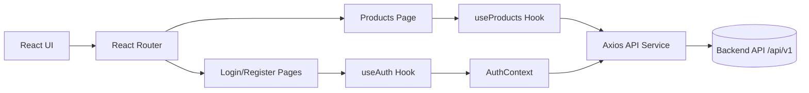
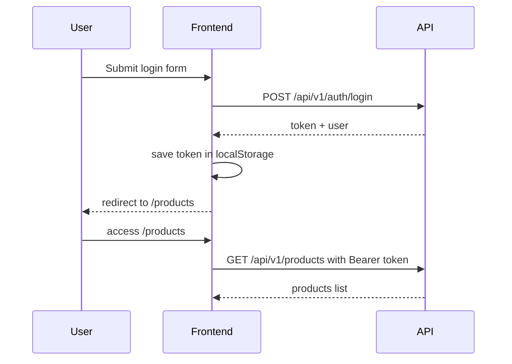
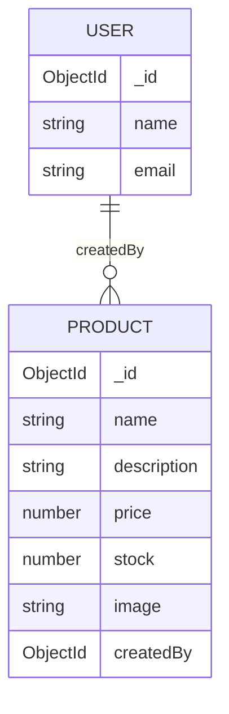

# Step 2 - Frontend React (Vite)

Este paso implementa el frontend del CRUD de productos con autenticacion JWT.

## Arquitectura general



## Flujo de autenticacion



## ERD de modelos usados por UI



## Estructura clave

- frontend/src/context/AuthContext.jsx: estado global de autenticacion.
- frontend/src/hooks/useAuth.js: login/register/logout y estado de sesion.
- frontend/src/hooks/useProducts.js: CRUD de productos con loading/error.
- frontend/src/services/api.js: instancia axios, token automatico e interceptor 401.
- frontend/src/utils/ProtectedRoute.jsx: protege rutas privadas.
- frontend/src/pages/LoginPage.jsx: pagina de inicio de sesion.
- frontend/src/pages/RegisterPage.jsx: pagina de registro.
- frontend/src/pages/ProductsPage.jsx: CRUD de productos con paginacion.

## Instalacion y ejecucion

```bash
cd step_2/frontend
npm install
npm run dev
```

## Si el estudiante inicia Step 2 desde cero

Crear proyecto con Vite:

```bash
cd step_2
npm create vite@latest frontend -- --template react
cd frontend
```

Instalar dependencias principales:

```bash
npm install react-router-dom axios
```

## Dependencias usadas en este paso

Dependencias de aplicacion (`dependencies`):

- `react`
- `react-dom`
- `react-router-dom`
- `axios`

Dependencias de desarrollo (`devDependencies`):

- `vite`
- `@vitejs/plugin-react`
- `eslint`
- `@eslint/js`
- `globals`
- `eslint-plugin-react-hooks`
- `eslint-plugin-react-refresh`
- `@types/react`
- `@types/react-dom`

Comando de referencia para instalar las extra del step:

```bash
npm install react-router-dom axios
```

## Orden logico recomendado para programar Step 2

1. `src/main.jsx` para envolver la app con Router/Providers.
2. `src/App.jsx` para definir rutas publicas y privadas.
3. `src/services/api.js` para centralizar Axios e interceptores.
4. `src/services/authService.js` y `src/services/productService.js`.
5. `src/context/AuthContext.jsx` y `src/context/authContext.js`.
6. `src/hooks/useAuth.js`.
7. `src/utils/ProtectedRoute.jsx`.
8. `src/hooks/useProducts.js`.
9. Paginas: `LoginPage`, `RegisterPage`, `ProductsPage`.
10. Componentes de UI: `Navbar`, `ProductForm`, `Pagination`, `LoadingSpinner`, `ErrorAlert`, `ConfirmModal`.

## Variables de entorno

Archivo: frontend/.env

```env
VITE_API_URL=http://localhost:5000/api/v1
```

Tambien puedes copiar desde frontend/.env.example.

## Flujo de prueba recomendado

1. Levanta backend de step_1 en puerto 5000.
2. Ejecuta frontend con npm run dev.
3. Ve a /register para crear usuario.
4. Ve a /products y crea un producto.
5. Valida editar, eliminar, paginar y buscar.
6. Cierra sesion y confirma redireccion a /login.

## Buenas practicas aplicadas

- Cliente Axios centralizado con interceptores.
- Hooks custom para separar UI y logica.
- Rutas privadas con ProtectedRoute.
- Estados de carga y error visibles.
- Preview de imagen antes de subir archivo.
