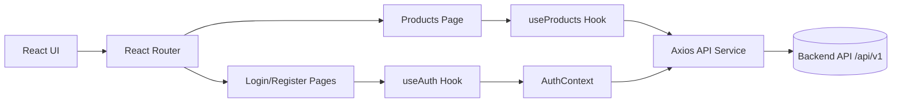
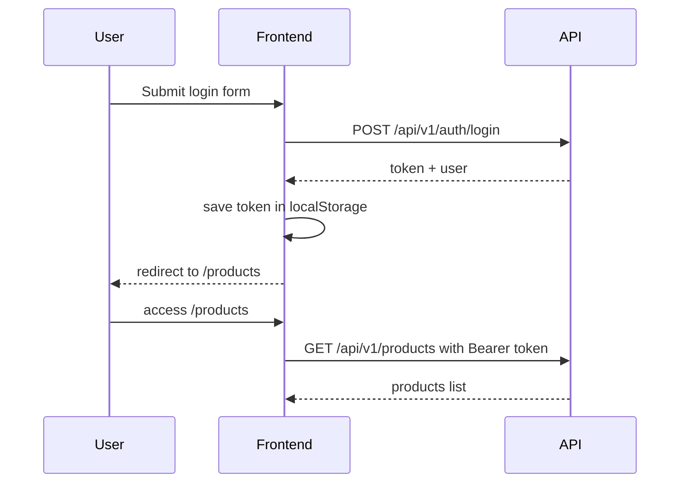
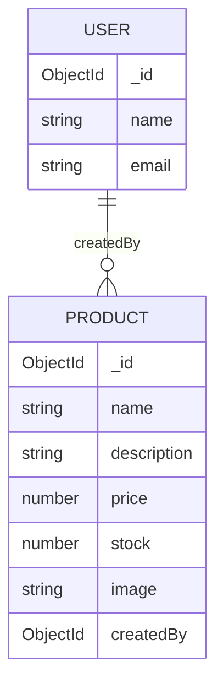

# Step 2 - Frontend React (Vite)

Este paso implementa el frontend del CRUD de productos con autenticacion JWT.

## Arquitectura general


```mermaid
flowchart LR
	UI[React UI] --> RC[React Router]
	RC --> P1[Login/Register Pages]
	RC --> P2[Products Page]
	P2 --> H[useProducts Hook]
	P1 --> A[useAuth Hook]
	A --> C[AuthContext]
	H --> S[Axios API Service]
	C --> S
	S --> API[(Backend API /api/v1)]
```

## Flujo de autenticacion


```mermaid
sequenceDiagram
	participant User
	participant Frontend
	participant API

	User->>Frontend: Submit login form
	Frontend->>API: POST /api/v1/auth/login
	API-->>Frontend: token + user
	Frontend->>Frontend: save token in localStorage
	Frontend-->>User: redirect to /products
	User->>Frontend: access /products
	Frontend->>API: GET /api/v1/products with Bearer token
	API-->>Frontend: products list
```

## ERD de modelos usados por UI


```mermaid
erDiagram
	USER ||--o{ PRODUCT : "createdBy"
	USER {
		ObjectId _id
		string name
		string email
	}
	PRODUCT {
		ObjectId _id
		string name
		string description
		number price
		number stock
		string image
		ObjectId createdBy
	}
```

## Estructura clave

- frontend/src/context/AuthContext.jsx: estado global de autenticacion.
- frontend/src/hooks/useAuth.js: login/register/logout y estado de sesion.
- frontend/src/hooks/useProducts.js: CRUD de productos con loading/error.
- frontend/src/services/api.js: instancia axios, token automatico e interceptor 401.
- frontend/src/utils/ProtectedRoute.jsx: protege rutas privadas.
- frontend/src/pages/LoginPage.jsx: pagina de inicio de sesion.
- frontend/src/pages/RegisterPage.jsx: pagina de registro.
- frontend/src/pages/ProductsPage.jsx: CRUD de productos con paginacion.

## Instalacion y ejecucion

```bash
cd step_2/frontend
npm install
npm run dev
```

## Si el estudiante inicia Step 2 desde cero

Crear proyecto con Vite:

```bash
cd step_2
npm create vite@latest frontend -- --template react
cd frontend
```

Instalar dependencias principales:

```bash
npm install react-router-dom axios
```

## Dependencias usadas en este paso

Dependencias de aplicacion (`dependencies`):

- `react`
- `react-dom`
- `react-router-dom`
- `axios`

Dependencias de desarrollo (`devDependencies`):

- `vite`
- `@vitejs/plugin-react`
- `eslint`
- `@eslint/js`
- `globals`
- `eslint-plugin-react-hooks`
- `eslint-plugin-react-refresh`
- `@types/react`
- `@types/react-dom`

Comando de referencia para instalar las extra del step:

```bash
npm install react-router-dom axios
```

## Orden logico recomendado para programar Step 2

La regla de oro es: **codifica primero lo que no importa nada del proyecto propio,
y deja para el final lo que mas importa**. Si intentas escribir `main.jsx` primero,
tu editor mostrara errores porque los modulos que importa aun no existen.

El diagrama de dependencias simplificado:

```
authContext.js   api.js
      |              |
      |         authService.js  productService.js
      |              |                |
  AuthContext.jsx----+            useProducts.js
      |
  useAuth.js
      |
  ProtectedRoute.jsx   [Componentes UI puros]
                               |
                    Navbar  ProductForm  Paginas (Login, Register, Products)
                                              |
                                           App.jsx
                                              |
                                           main.jsx
```

---

### Paso 1 — `src/context/authContext.js`

Crea el objeto Context con `createContext(null)`. Es la "casilla vacia" donde
React almacenara el estado de autenticacion global. Sin este archivo ningun otro
modulo puede importar el contexto.

> **Depende de:** solo `react` (`createContext`)
> **Lo usan:** `AuthContext.jsx` (paso 5), `useAuth.js` (paso 6)

Empieza aqui porque no importa nada del proyecto propio. Es la base de todo el
sistema de autenticacion.

---

### Paso 2 — `src/services/api.js`

Crea la instancia de Axios configurada con la URL base del backend (`VITE_API_URL`).
Incluye dos interceptores: uno que agrega el header `Authorization: Bearer {token}`
en cada peticion saliente, y otro que emite el evento `auth:unauthorized` cuando
el backend responde con 401 (sesion vencida).

> **Depende de:** solo `axios` (libreria externa, ya instalada con `npm install`)
> **Lo usan:** `authService.js` (paso 3), `productService.js` (paso 4)

Todos los servicios importan esta instancia. Si la codificas despues de los servicios,
obtendras un error de modulo no encontrado al momento de ejecutar.

---

### Paso 3 — `src/services/authService.js`

Define las funciones `login(email, password)` y `register(name, email, password)`.
Cada funcion llama a la instancia `api` del paso anterior y retorna la respuesta
del backend con `{ token, user }`.

> **Depende de:** `api.js` (paso 2)
> **Lo usan:** `AuthContext.jsx` (paso 5)

---

### Paso 4 — `src/services/productService.js`

Define las funciones `getProducts`, `createProduct`, `updateProduct` y `deleteProduct`.
Las operaciones de crear y editar envian los datos como `FormData` (multipart/form-data)
para soportar la subida de imagen al backend.

> **Depende de:** `api.js` (paso 2)
> **Lo usan:** `useProducts.js` (paso 8)

Los pasos 3 y 4 pueden codificarse en paralelo porque ambos solo dependen de `api.js`.

---

### Paso 5 — `src/context/AuthContext.jsx`

Implementa el componente `AuthProvider` que envuelve la aplicacion. Gestiona el
estado `{ token, user, loading, error }` y expone las funciones `login`, `register`
y `logout`. Persiste la sesion en `localStorage` para que el token sobreviva
recargas de pagina.

> **Depende de:** `authContext.js` (paso 1), `authService.js` (paso 3)
> **Lo usan:** `useAuth.js` (paso 6), `main.jsx` (paso 16)

Este archivo es el corazon de la autenticacion. Sin el, `useAuth` no tiene
estado del que leer.

---

### Paso 6 — `src/hooks/useAuth.js`

Hook personalizado que llama a `useContext(AuthContext)` y retorna el estado y
metodos de autenticacion. Centraliza el acceso al contexto para que los componentes
no necesiten importar directamente `AuthContext`.

> **Depende de:** `authContext.js` (paso 1) o `AuthContext.jsx` (paso 5)
> **Lo usan:** `ProtectedRoute.jsx` (paso 7), `Navbar.jsx` (paso 10), `LoginPage.jsx` (paso 12), `RegisterPage.jsx` (paso 13), `ProductsPage.jsx` (paso 14)

Este hook es el punto de acceso publico al contexto. Todos los componentes que
necesiten saber si el usuario esta logueado importan este hook, no el contexto directo.

---

### Paso 7 — `src/utils/ProtectedRoute.jsx`

Componente que verifica si el usuario esta autenticado. Si no lo esta, redirige
automaticamente a `/login` usando `<Navigate>` de React Router. Envuelve cualquier
ruta privada en `App.jsx`.

> **Depende de:** `useAuth.js` (paso 6), `react-router-dom` (`Navigate`)
> **Lo usan:** `App.jsx` (paso 15)

---

### Paso 8 — `src/hooks/useProducts.js`

Hook personalizado que encapsula toda la logica del CRUD de productos: estado de
`products`, `meta` (paginacion), `loading`, `submitting` y `error`. Expone las
funciones `fetchProducts`, `handleCreate`, `handleUpdate` y `handleDelete`.

> **Depende de:** `productService.js` (paso 4)
> **Lo usan:** `ProductsPage.jsx` (paso 14)

---

### Paso 9 — Componentes UI puros

Cuatro componentes sin dependencias propias del proyecto. Puedes codificarlos en
cualquier orden entre si porque ninguno importa nada de los otros archivos del proyecto:

- `src/components/LoadingSpinner.jsx` — spinner accesible con `aria-live`
- `src/components/ErrorAlert.jsx` — muestra un mensaje de error si la prop existe
- `src/components/Pagination.jsx` — botones Anterior / Siguiente con logica de deshabilitado
- `src/components/ConfirmModal.jsx` — modal de confirmacion para la accion de eliminar

> **Dependen de:** solo `react`
> **Los usan:** `LoginPage.jsx`, `RegisterPage.jsx`, `ProductsPage.jsx`

---

### Paso 10 — `src/components/Navbar.jsx`

Barra de navegacion superior que muestra el nombre del usuario autenticado y el
boton de cerrar sesion. Llama a `logout()` del hook `useAuth`.

> **Depende de:** `useAuth.js` (paso 6)
> **Lo usan:** `ProductsPage.jsx` (paso 14)

---

### Paso 11 — `src/components/ProductForm.jsx`

Formulario reutilizable para crear y editar productos. Recibe `initialData` y
`onSubmit` como props. Incluye preview de la imagen seleccionada usando
`URL.createObjectURL` y limpia el blob URL al desmontar para evitar fugas de memoria.

> **Depende de:** solo `react`
> **Lo usan:** `ProductsPage.jsx` (paso 14)

Al recibir todo por props, este componente no necesita importar ningun modulo
del proyecto, lo que lo hace facil de probar de forma aislada.

---

### Paso 12 — `src/pages/LoginPage.jsx`

Pagina con formulario de email y contrasena. Al enviar llama a `login()` de
`useAuth` y redirige a `/products` si tiene exito. Muestra `ErrorAlert` si
hay error y `LoadingSpinner` mientras espera la respuesta.

> **Depende de:** `useAuth.js` (paso 6), `ErrorAlert.jsx` (paso 9), `LoadingSpinner.jsx` (paso 9), `react-router-dom` (`Link`, `Navigate`)
> **Lo usan:** `App.jsx` (paso 15)

---

### Paso 13 — `src/pages/RegisterPage.jsx`

Pagina con formulario de nombre, email y contrasena. Estructura identica a
`LoginPage` pero llama a `register()` en lugar de `login()`.

> **Depende de:** `useAuth.js` (paso 6), `ErrorAlert.jsx` (paso 9), `LoadingSpinner.jsx` (paso 9), `react-router-dom` (`Link`, `Navigate`)
> **Lo usan:** `App.jsx` (paso 15)

---

### Paso 14 — `src/pages/ProductsPage.jsx`

Pagina principal de la aplicacion. Coordina el estado de la vista activa
(`list` vs `create` / `edit`), delega el CRUD al hook `useProducts`, y renderiza
`Navbar`, `ProductForm`, `Pagination`, `LoadingSpinner`, `ErrorAlert` y
`ConfirmModal` segun el estado actual.

> **Depende de:** `useProducts.js` (paso 8), `useAuth.js` (paso 6), `Navbar.jsx` (paso 10), `ProductForm.jsx` (paso 11), y todos los componentes UI del paso 9
> **Lo usan:** `App.jsx` (paso 15)

Este archivo es el mas complejo del proyecto. Todos sus imports deben existir antes
de codificarlo — por eso es el ultimo de las paginas.

---

### Paso 15 — `src/App.jsx`

Define el arbol de rutas con `<Routes>`:
- `/login` → `LoginPage`
- `/register` → `RegisterPage`
- `/products` → `ProtectedRoute` envolviendo `ProductsPage`
- `/` → redirige a `/products`

> **Depende de:** `LoginPage.jsx` (paso 12), `RegisterPage.jsx` (paso 13), `ProductsPage.jsx` (paso 14), `ProtectedRoute.jsx` (paso 7), `react-router-dom` (`Routes`, `Route`, `Navigate`)
> **Lo usan:** `main.jsx` (paso 16)

---

### Paso 16 — `src/main.jsx`

Punto de entrada de la aplicacion. Envuelve `<App>` con `<BrowserRouter>` (habilita
el enrutamiento) y `<AuthProvider>` (habilita el estado global de autenticacion).
Es el ultimo archivo porque necesita que absolutamente todo lo demas ya exista.

> **Depende de:** `App.jsx` (paso 15), `AuthContext.jsx` (paso 5), `react-router-dom` (`BrowserRouter`)
> **Lo usan:** `index.html` (via el script de entrada de Vite)

Antes de ejecutar `npm run dev`, asegurate de crear `frontend/.env` con:

```env
VITE_API_URL=http://localhost:5000/api/v1
```

## Variables de entorno

Archivo: frontend/.env

```env
VITE_API_URL=http://localhost:5000/api/v1
```

Tambien puedes copiar desde frontend/.env.example.

## Flujo de prueba recomendado

1. Levanta backend de step_1 en puerto 5000.
2. Ejecuta frontend con npm run dev.
3. Ve a /register para crear usuario.
4. Ve a /products y crea un producto.
5. Valida editar, eliminar, paginar y buscar.
6. Cierra sesion y confirma redireccion a /login.

## Buenas practicas aplicadas

- Cliente Axios centralizado con interceptores.
- Hooks custom para separar UI y logica.
- Rutas privadas con ProtectedRoute.
- Estados de carga y error visibles.
- Preview de imagen antes de subir archivo.
